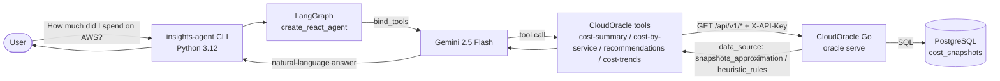

# CloudOracle

 

A Go FinOps toolkit that ships in two modes from the same `oracle` binary, with a polyglot agent extension in progress:

- **v1 — Audit existing cloud spend.** Ingest live EC2/RDS/EBS/Lambda inventory from AWS, GCP, or Azure into Postgres, run deterministic rules over it, and produce an executive PDF + dashboard with an LLM-narrated summary. See **[docs/v1-guide.md](docs/v1-guide.md)**.
- **v2 — Predict cost impact of a Terraform PR before merge.** Read `terraform show -json plan.tfplan`, look every changing resource up against the AWS Pricing API, and post (or upsert) a Markdown comment on the PR with the net monthly delta, top movers, and a 1–3 sentence LLM narrative. Ships as a GitHub Action and as the `oracle pr-check` subcommand. **Current focus.** See **[docs/v2-guide.md](docs/v2-guide.md)**.
- **v3 — Insights Agent (in progress).** Polyglot Go + Python extension adding agentic FinOps analysis on top of v1/v2 cost data — LangGraph orchestration, RAG over FinOps documentation, multi-agent supervisor pattern, and production guardrails. See **[AI Insights Agent](#ai-insights-agent)** below and **[insights-agent/README.md](insights-agent/README.md)**.

## AI Insights Agent

A Python sibling of the Go server that lets you ask FinOps questions in
natural language. The agent decides which `/api/v1` endpoint to call, fetches
the data over HTTP, and answers in the user's language — surfacing the
"snapshot approximation" caveat when accuracy matters.



The agent ships four tools: two cost endpoints (totals per provider, per-service
breakdown), a savings-recommendations endpoint that answers "where can I save
money?" from the rule-based analyzer, and a cost-trends endpoint that answers "is
my spend growing?" with a per-day series and a precomputed change summary. Setup,
env vars, CLI usage, and the smoke test are documented in
**[insights-agent/README.md](insights-agent/README.md)**.

## v2 — Quick start (current focus)

CloudOracle parses a Terraform plan, prices every changing resource, and posts a PR comment like this:

> ## 💰 Cloud Cost Impact
>
> **Net monthly change: +$389.35** 🔴
>
> The Aurora cluster instance dominates this change at ~$204/month — over half the total. If this is intended for a non-production environment, an `aws_db_instance` running `db.t3.medium` would land around $60/mo for similar functional coverage.
>
> ### Top movers by cost impact
>
>
> | Resource                          | Action    | Δ Monthly | Confidence |
> | --------------------------------- | --------- | ---------- | ---------- |
> | `aws_rds_cluster_instance.aurora` | 🆕 create | +$204.40   | low        |
> | `aws_db_instance.db`              | 🆕 create | +$71.36    | low        |
> | `aws_instance.web`                | 🆕 create | +$64.74    | low        |

Drop this workflow into `.github/workflows/cost-comment.yml`:

```yaml
name: Terraform Plan Cost Comment
on:
  pull_request:
    paths: ['**.tf']

permissions:
  pull-requests: write
  id-token: write
  contents: read

jobs:
  cost:
    runs-on: ubuntu-latest
    steps:
      - uses: actions/checkout@v4
      - uses: aws-actions/configure-aws-credentials@v4
        with:
          role-to-assume: arn:aws:iam::123456789012:role/GitHubActionsCloudOracle
          aws-region: us-east-2
      - uses: hashicorp/setup-terraform@v3
      - run: terraform init && terraform plan -out=tf.plan
      - run: terraform show -json tf.plan > tf-plan.json
      - uses: Cro22/CloudOracle@v2.0.0
        with:
          plan-file: tf-plan.json
        env:
          ANTHROPIC_API_KEY: ${{ secrets.ANTHROPIC_API_KEY }}
```

For Action inputs, CLI flags, exit codes, LLM narrative behavior, and the list of supported resources, see **[docs/v2-guide.md](docs/v2-guide.md)**.

## v1 — Quick start

```bash
docker compose up --build
docker compose exec app /app/cloudoracle seed --count 120
# → open http://localhost:8080
```

The synthetic provider needs no credentials. To run against AWS / GCP / Azure, see **[docs/cloud-providers.md](docs/cloud-providers.md)**. For the full walkthrough (PDF reports, dashboard, LLM setup, exports, trends), see **[docs/v1-guide.md](docs/v1-guide.md)**.

## Tech Stack


| Component   | Technology                                   |
| ----------- | -------------------------------------------- |
| Language    | Go 1.25                                      |
| Database    | PostgreSQL 16 (Alpine)                       |
| DB Driver   | pgx v5 (connection pool)                     |
| AWS SDK     | aws-sdk-go-v2 (EC2, RDS, Lambda, STS)        |
| GCP SDK     | Google Cloud Go (Compute, SQL, Functions)    |
| Azure SDK   | Azure SDK for Go (Compute, SQL, App Service) |
| Concurrency | `golang.org/x/sync/errgroup`                 |
| Logging     | `log/slog` (structured, text/JSON)           |
| PDF         | go-pdf/fpdf                                  |
| LLM         | Gemini / Claude / OpenAI                     |
| Testing     | `testing` + `httptest`                       |
| Containers  | Docker Compose + multi-stage Dockerfile      |

## Documentation

- **[docs/v2-guide.md](docs/v2-guide.md)** — Terraform PR cost analysis (Action inputs, CLI flags, exit codes, supported resources)
- **[docs/v1-guide.md](docs/v1-guide.md)** — Cloud cost audit walkthrough (seed, analyze, PDF, dashboard, LLM setup, sample output)
- **[docs/architecture.md](docs/architecture.md)** — v1/v2 internal layout, analyzer + LLM provider design, architecture decisions, lessons learned
- **[docs/cloud-providers.md](docs/cloud-providers.md)** — AWS, GCP, Azure setup (credentials, IAM scopes, region config)
- **[docs/configuration.md](docs/configuration.md)** — environment variables reference
- **[docs/testing.md](docs/testing.md)** — unit and integration test strategy and coverage

## Roadmap

### v3 — Insights Agent (in progress)

- [X]  **Milestone 8.0** — Authenticated `/api/v1/cost-summary` and `/api/v1/cost-by-service` Go endpoints (X-API-Key, snapshot-derived totals with explicit `data_source` disclaimer, machine-readable error codes)
- [X]  **Milestone 8.1** — Python `insights-agent` sibling: LangGraph `create_react_agent` graph with two CloudOracle tools, Gemini provider, pydantic-settings config, structlog matching the Go slog format, CLI with `--verbose` / `--json` flags, 92% test coverage with mocked LLM + mocked HTTP. See **[insights-agent/](insights-agent/README.md)**
- [ ]  **Milestone 8.2** — Additional tools (in progress). Done: authenticated `GET /api/v1/recommendations` (rule-based savings findings, `data_source: heuristic_rules`) + `cloudoracle_recommendations` tool; authenticated `GET /api/v1/cost-trends` (per-day series with precomputed change/direction, optional provider filter) + `cloudoracle_cost_trends` tool. Next: resources / inventory tool
- [ ]  **Milestone 8.3** — pgvector + RAG over FinOps documentation
- [ ]  **Milestone 8.4** — Hand-rolled supervisor (multi-agent), replacing `create_react_agent`
- [ ]  **Milestone 8.5** — Production guardrails: cost caps, deterministic fallback, semantic answer validation, HTTP API surface
- [ ]  **Milestone 8.7** — Real billing / Cost Explorer integration replacing the snapshot approximation

### v2 — Terraform PR cost analysis

- [X]  Terraform plan parser — `internal/iac` reads `terraform show -json` into a typed `Plan` model with action classification (create / update / replace / delete / no-op) and `after_unknown` handling
- [X]  AWS Pricing API client + cache — `internal/pricing.Client` wraps AWS SDK v2 `pricing:GetProducts`; `internal/pricing.Cache` adds a 7-day disk cache keyed by service+filters
- [X]  Per-resource estimators — EC2, EBS, RDS, Aurora cluster instance, Lambda, NAT gateway with breakdown line items and assumption notes
- [X]  CostDiff aggregator — `internal/diff.Analyze` collapses per-resource estimates into a plan-wide picture with Created / Deleted / Updated / Replaced / Skipped slices, top movers, and aggregate confidence
- [X]  Markdown renderer — `internal/diff.RenderMarkdown` produces the canonical PR comment (header / top movers table / full breakdown / caveats / marker footer), templated and golden-tested
- [X]  LLM-narrated PR comment — `RenderMarkdownWithLLM` swaps the templated narrative for a 1–3 sentence LLM output with caveat grouping, sanity checks (length cap, preamble strip, paragraph-break warn), and silent fallback to the templated text on any failure
- [X]  GitHub REST client — `internal/github.PostOrUpdateComment` lists, finds-by-marker, and PATCHes / POSTs; paginated with cap, body truncation guard at 60KB, multi-match resolution to most-recently-updated
- [X]  `oracle pr-check` subcommand — orchestrates the whole pipeline, with differentiated exit codes (1 input / 2 pricing / 3 output / 4 github) and `--no-llm` / `--post` switches
- [X]  GitHub Action packaging — `Dockerfile.action`, `action.yml`, POSIX `entrypoint.sh` that auto-extracts the PR number from `GITHUB_REF` on `pull_request[_target]` events; reference workflows under `.github/examples/`

### v1 — Cloud cost audit

- [X]  LLM-powered analysis: executive summaries generated by Gemini / Claude / OpenAI
- [X]  PDF report generation with executive summary and severity-coded tables
- [X]  Real AWS integration via SDK (EC2, RDS, EBS, Lambda with STS validation and graceful degradation)
- [X]  Multi-cloud support (GCP, Azure) with Compute, SQL, Disks, and Functions for each provider
- [X]  Cost trend tracking over time (automatic snapshots on seed + `trend` command)
- [X]  Parallel fetch with `errgroup` and per-service `context.WithTimeout`
- [X]  Structured logging with `log/slog` (text or JSON output, level-configurable)
- [X]  Centralized configuration loaded once and injected as typed structs
- [X]  Export findings to JSON/CSV (stdout or file, RFC 4180 escaping, pipeline-friendly)
- [X]  Web dashboard with cost visualizations (React + Recharts + Tailwind v4, embedded in the Go binary via `go:embed`, served by `oracle serve`)
- [X]  SDK-client interfaces for real-provider unit tests — every provider fetcher (AWS / GCP / Azure) is exercised against fake SDK clients, covering pagination, per-service errors, and graceful degradation
- [X]  Fail-fast configuration validation — `config.Load() (Config, error)` accumulates every invalid env var into a single readable error, with cross-field rules (provider=gcp without `GOOGLE_CLOUD_PROJECT`, `LLM_PROVIDER=claude` without `ANTHROPIC_API_KEY`, etc.)
- [X]  Resilient LLM HTTP layer — shared `RoundTripper` retries 429/5xx/network errors with exponential-backoff-with-full-jitter, honors `Retry-After`, replays request bodies, cancellable via context
- [X]  testcontainers-based integration tests — real Postgres 16 in Docker via `testcontainers-go`, gated by `//go:build integration`, with a full seed → analyze E2E test and a GitHub Actions workflow that runs both unit and integration tiers

## License

Apache 2.0
