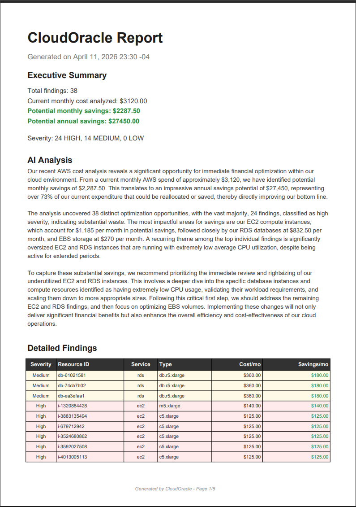
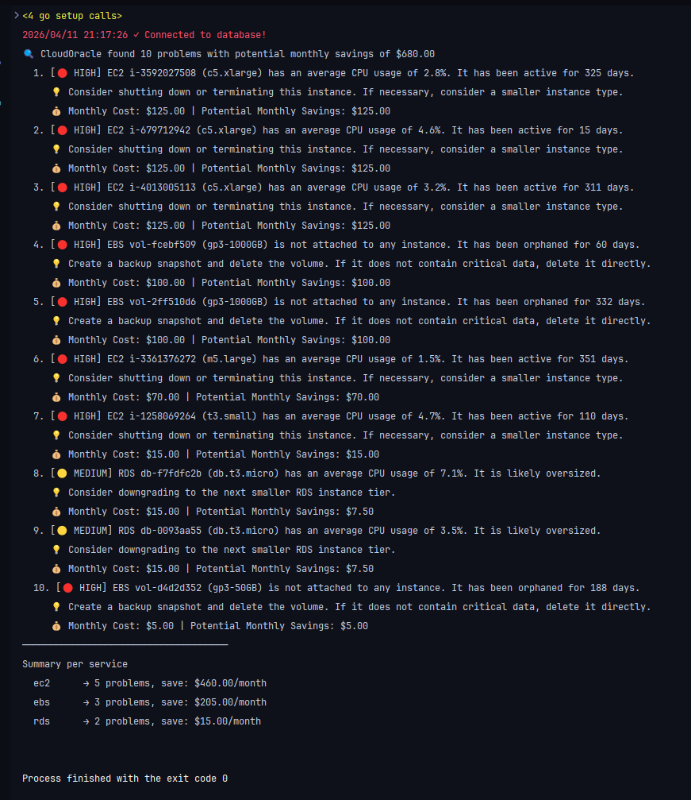

# CloudOracle


A CLI tool built in Go that analyzes cloud infrastructure resources and detects cost optimization opportunities. It simulates a real-world FinOps workflow: ingesting cloud resource data, storing it in PostgreSQL, and running deterministic rules to surface waste such as idle EC2 instances, orphaned EBS volumes, oversized RDS databases, and over-provisioned Lambda functions.

## Why this project?

Cloud waste is a real problem. Companies routinely overspend 20-30% on cloud infrastructure because nobody is watching the bill. CloudOracle demonstrates how to build a system that catches these issues automatically, using the same patterns that tools like AWS Trusted Advisor or Datadog Cloud Cost Management use internally.

Unlike policy engines like **Cloud Custodian** that focus on automated enforcement, CloudOracle is an *analysis-first* tool built for FinOps visibility — combining deterministic rules with LLM-generated insights to produce executive-ready reports and dashboards.

## Features

- **Multi-cloud support** - Switch between AWS, GCP, Azure, and synthetic data via a single env var (`CLOUDORACLE_PROVIDER`)
- **Real AWS integration** - Fetches live EC2 instances, RDS databases, EBS volumes, and Lambda functions using AWS SDK v2 with STS credential validation
- **Real GCP integration** - Fetches Compute Engine VMs, Cloud SQL instances, Persistent Disks, and Cloud Functions using Google Cloud Go client libraries
- **Real Azure integration** - Fetches Virtual Machines, Azure SQL databases, Managed Disks, and Function Apps using Azure SDK for Go
- **Synthetic data generation** - Realistic resource simulation across EC2, RDS, EBS, and Lambda with configurable account IDs and resource counts
- **PostgreSQL persistence** - Transactional bulk inserts with upsert support (`ON CONFLICT DO UPDATE`)
- **Rule-based analysis engine** - Pluggable rules architecture where each rule is a pure function `Resource -> Finding`
- **4 detection rules**:
  - `ec2-idle` - Flags instances with <5% CPU usage running for more than 7 days (HIGH severity)
  - `rds-oversized` - Identifies RDS instances with <10% CPU utilization (MEDIUM severity)
  - `ebs-orphan` - Detects unattached EBS volumes with zero usage (HIGH severity)
  - `lambda-over-provisioned` - Finds Lambda functions with >1GB memory and low invocation counts (LOW severity)
- **Savings-ranked output** - Findings are sorted by potential monthly savings (highest first)
- **Service summary** - Aggregated view of findings and potential savings per AWS service
- **PDF report generation** - Professional executive-style PDF reports with severity-coded tables, recommended actions, and annual savings projections
- **LLM-powered executive summaries** - Pluggable provider layer (Gemini, Claude, OpenAI) that turns raw findings into a CTO/CFO-ready narrative embedded directly into the PDF report
- **Resilient LLM calls** - Shared `http.RoundTripper` retries 429s, 5xx, and network errors with exponential-backoff-with-full-jitter; honors the `Retry-After` header from Anthropic/OpenAI; cancellable via the request context
- **Cost trend tracking** - Automatic cost snapshots on every seed, with a `trend` command that shows per-service cost changes over time with directional arrows and percentage deltas
- **Parallel resource fetching** - Each provider fans out service calls (Compute / SQL / Disks / Functions) concurrently with `errgroup`, cutting scan time on accounts with many services
- **Per-service timeouts** - Every API call to a cloud service is wrapped in `context.WithTimeout` so a single slow region can't stall the entire scan
- **Structured logging (`log/slog`)** - Every log line carries typed attributes (`provider`, `service`, `error`, ...), with pluggable text or JSON output for ingestion into log aggregators
- **Centralized configuration** - A single `config.Load()` reads every env var up front and is injected into the cloud, LLM, and DB layers — no component reaches for `os.Getenv` on its own
- **Export findings to JSON or CSV** - Pipe analyzer output into downstream tooling (dashboards, spreadsheets, ticket systems) via `oracle export --format=json|csv`, writing to stdout or a file
- **Single-binary web dashboard** - React + Recharts UI embedded into the Go binary via `go:embed`; `oracle serve` boots API and dashboard on one port with no external assets required

## Architecture

```
cmd/oracle/main.go          # CLI entry point (seed, list, analyze, report, trend)
internal/
  config/
    config.go               # Central Config + Load(): reads every env var up front
  logging/
    logging.go              # slog setup (text or JSON, configurable level)
  shared/
    resource.go             # Resource domain model
    finding.go              # Finding + Severity types
  cloud/
    provider.go             # CloudProvider interface (Strategy pattern)
    factory.go              # Provider factory: Config -> concrete provider
    synthetic_provider.go   # Synthetic data provider (dev/demo)
    aws_provider.go         # Real AWS provider — parallel fetchers with per-service timeouts
    aws_clients.go          # Narrow ec2/rds/lambda interfaces — *aws.Client satisfies them, fakes drive tests
    gcp_provider.go         # Real GCP provider — parallel fetchers with per-service timeouts
    gcp_clients.go          # Lister interfaces + SDK adapters that flatten pagination
    azure_provider.go       # Real Azure provider — parallel fetchers with per-service timeouts
    azure_clients.go        # Lister interfaces + SDK adapters that flatten pagers
  generator/
    generator.go            # Synthetic data generation for EC2, RDS, EBS, Lambda
  analyzer/
    analyzer.go             # Rule engine: runs all rules, sorts by savings
    rules.go                # Detection rules (pure functions)
  report/
    pdf.go                  # PDF report generator (executive summary + findings table)
    export.go               # JSON and CSV exporters for findings
  llm/
    provider.go             # Provider interface + Config-driven factory (Gemini / Claude / OpenAI)
    prompt.go               # Shared prompt builder (findings -> structured analysis)
    http.go                 # newHTTPClient: builds the *http.Client every provider uses
    retry.go                # http.RoundTripper that retries 429/5xx/net errors with full-jitter backoff
    gemini.go               # Google Gemini client (gemini-2.5-flash)
    claude.go               # Anthropic Claude client (claude-haiku-4-5)
    openai.go               # OpenAI client (gpt-4o-mini)
  db/
    db.go                   # PostgreSQL connection pool (pgx)
    insert.go               # Transactional insert + query logic
    snapshots.go            # Cost snapshot creation + trend queries
    trends.go               # Aggregated trends for the /api/trends endpoint
    dbtest/postgres.go      # testcontainers-go helper (gated by `integration` build tag)
    *_integration_test.go   # //go:build integration — real Postgres tests
  e2e/
    seed_analyze_test.go    # //go:build integration — full seed -> analyze flow
  migrations/
    migrations.go           # go:embed runner executed at app startup
    001_create_resources.sql
    002_create_cost_snapshots.sql
Dockerfile                  # Multi-stage: npm build → go build → alpine runtime
docker-compose.yml          # Postgres (with healthcheck) + app service
```

The cloud provider layer uses the **Strategy pattern**: `CloudProvider` is the interface, and `SyntheticProvider`, `AWSProvider`, `GCPProvider`, and `AzureProvider` are the concrete strategies. `factory.go` selects the strategy at runtime based on the `Config` loaded from `internal/config`. This lets `main.go` work with any provider without knowing which one is active.

Configuration is loaded once in `main()` via `config.Load()` and injected downward. No component in `cloud/`, `llm/`, or `db/` calls `os.Getenv` directly — every dependency arrives as a typed struct field. This keeps the surface area predictable, makes the code easy to test with struct literals, and means adding a new env var is a single-file change in `internal/config/config.go`.

Each real provider's `FetchResources` fans out its service calls (for example: EC2, RDS, EBS, and Lambda on AWS) onto separate goroutines via `golang.org/x/sync/errgroup`. Each goroutine wraps its API call in `context.WithTimeout(cfg.ServiceTimeout)`, so one slow service can't block the others and a regional outage surfaces as a structured warning rather than a hung process. Per-service failures are logged with `slog` and the successful services still return their resources — the scan degrades gracefully instead of failing hard.

The SDK call surface for every real provider is hidden behind narrow interfaces (`ec2APIClient`, `gcpInstancesLister`, `azureVMLister`, …) defined in `aws_clients.go` / `gcp_clients.go` / `azure_clients.go`. Concrete `*ec2.Client`, `*compute.InstancesClient`, and `*armcompute.VirtualMachinesClient` values satisfy those interfaces transparently, so production code is unchanged — but unit tests can plug in fakes that return canned slices and simulate API errors without ever touching the network or needing credentials. The mapping logic (`SDK type -> shared.Resource`) stays inline with the fetcher, which means tests can exercise pagination, error handling, graceful degradation, and edge-case field handling end-to-end.

## Tech Stack

| Component    | Technology                         |
|-------------|-------------------------------------|
| Language    | Go 1.25                             |
| Database    | PostgreSQL 16 (Alpine)              |
| DB Driver   | pgx v5 (connection pool)            |
| AWS SDK     | aws-sdk-go-v2 (EC2, RDS, Lambda, STS) |
| GCP SDK     | Google Cloud Go (Compute, SQL, Functions) |
| Azure SDK   | Azure SDK for Go (Compute, SQL, App Service) |
| Concurrency | `golang.org/x/sync/errgroup`        |
| Logging     | `log/slog` (structured, text/JSON)  |
| PDF         | go-pdf/fpdf                         |
| LLM         | Gemini / Claude / OpenAI            |
| Testing     | `testing` + `httptest`              |
| Containers  | Docker Compose + multi-stage Dockerfile |

## Getting Started

### Prerequisites

- Go 1.25+
- Docker & Docker Compose
- (Optional) AWS CLI configured with a `cloudoracle` profile for real AWS integration (see [Running against cloud providers](#running-against-cloud-providers) below)

### 1. Start the stack

Single command for the full demo (Postgres + API + embedded React dashboard):

```bash
docker compose up --build
# → open http://localhost:8080
```

Compose brings up two services:
- **postgres** — PostgreSQL 16 with a healthcheck; the app only starts once it responds to `pg_isready`.
- **app** — multi-stage build of the Go binary with the React bundle embedded via `go:embed`, exposed on `:8080`.

The app auto-applies the SQL migrations in `internal/migrations/*.sql` on every startup (they're idempotent — `CREATE TABLE/INDEX IF NOT EXISTS`), so there's no separate migration step. To populate demo data:

```bash
docker compose exec app /app/cloudoracle seed --count 120
```

For local development without Docker you still need Postgres running somewhere; the easiest is `docker compose up -d postgres` and then run the Go binary on the host. Migrations run automatically whichever way you boot the app.

### 2. Seed sample data

```bash
go run cmd/oracle/main.go seed --account acc-001 --count 100
```

### 3. List all resources

```bash
go run cmd/oracle/main.go list
```

### 4. Run the cost analyzer

```bash
go run cmd/oracle/main.go analyze
```

### 5. Generate a PDF report

```bash
go run cmd/oracle/main.go report --output cloudoracle-report.pdf
```

This generates a professional PDF with:
- Executive summary (total findings, monthly/annual savings projections)
- Severity breakdown (HIGH / MEDIUM / LOW)
- Color-coded findings table with cost and savings per resource
- Recommended actions for each finding
- **AI-generated narrative** (when an LLM provider is configured) — 3-4 paragraph executive summary written for a CTO/CFO audience, focused on financial impact, highest-priority problems, and recommended next steps



### 6. View cost trends

Each `seed` automatically creates a cost snapshot. After running `seed` multiple times (on different days or with different data), view how costs change:

```bash
go run cmd/oracle/main.go trend --days 30
```

```
Cost Trends (last 30 days, 3 snapshots)

Service      Oldest       Latest         Change
────────────────────────────────────────────────────────
ebs          $   100.00 $    90.00    -10.00 (-10.0%) ↓
ec2          $   460.00 $   510.00    +50.00 (+10.9%) ↑
lambda       $     2.50 $     3.10     +0.60 (+24.0%) ↑
rds          $   180.00 $   195.00    +15.00 (+8.3%)  ↑
────────────────────────────────────────────────────────
Total        $   742.50 $   798.10    +55.60 (+7.5%)  ↑
```

### 7. Export findings to JSON or CSV

Run the analyzer and pipe its findings into another tool — a dashboard, a spreadsheet, a ticketing system. By default, the exporter writes to stdout so it composes naturally with shell pipelines; pass `--output` to write to a file.

```bash
# Pretty-printed JSON to stdout
go run cmd/oracle/main.go export --format=json

# CSV to a file (header row + one finding per row)
go run cmd/oracle/main.go export --format=csv --output findings.csv

# Pipe straight into jq
go run cmd/oracle/main.go export --format=json | jq '.[] | select(.Severity == "High")'
```

The JSON output is an array of `Finding` objects. The CSV output has a fixed header: `resource_id, service, resource_type, region, rule, severity, monthly_cost, monthly_savings, description, recommendation`. Numeric fields are formatted with two decimals. Commas, quotes, and newlines in descriptions are escaped per RFC 4180 — the output is safe to open in Excel or parse with any standard CSV library.

### 8. Web dashboard

CloudOracle ships a React + Recharts dashboard that reads the same database as the CLI. There are two workflows:

**Production / demo — one binary, one command.** The Go binary embeds the compiled frontend via `go:embed`, so after a single `npm run build` the whole stack (API + UI) is served on one port.

```bash
# Build the React bundle into internal/api/dist (go:embed target)
cd web
npm install   # first time only
npm run build
cd ..

# Build the self-contained binary and run it
go build -o cloudoracle ./cmd/oracle
./cloudoracle serve --port 8080
# → open http://localhost:8080
```

The binary is fully self-contained. Copy the single file (`cloudoracle` / `cloudoracle.exe`) to any machine, point it at a reachable Postgres via `DB_*` env vars, and the dashboard loads. No `web/` directory needed at runtime.

**Development — hot reload.** During iteration, run the API and the Vite dev server separately so you get HMR on React changes without rebuilding Go:

```bash
# Terminal 1 — API on :8080
go run ./cmd/oracle serve --port 8080

# Terminal 2 — Vite on :5173 with /api/* proxied to :8080
cd web
npm run dev
# → open http://localhost:5173
```

> **Note:** `go:embed` requires `internal/api/dist/` to exist at compile time. The repo commits a `.gitkeep` so `go build` always works — if you haven't run `npm run build`, visiting the root route shows a "Dashboard bundle not found" page with instructions. The JSON API at `/api/*` works either way.

### 9. (Optional) Enable the LLM-powered executive summary

The `report` command will automatically call an LLM provider if any supported API key is present in the environment. No flags required — just export a key and run `report` again. If no key is configured, the PDF is still generated without the narrative section.

| Provider | Env variable        | Default model        |
|----------|---------------------|----------------------|
| Gemini   | `GEMINI_API_KEY`    | `gemini-2.5-flash`   |
| Claude   | `ANTHROPIC_API_KEY` | `claude-haiku-4-5`   |
| OpenAI   | `OPENAI_API_KEY`    | `gpt-4o-mini`        |

```bash
# Pick one
export GEMINI_API_KEY=...
export ANTHROPIC_API_KEY=...
export OPENAI_API_KEY=...

# Force a specific provider when multiple keys are present
export LLM_PROVIDER=claude   # gemini | claude | openai

go run cmd/oracle/main.go report --output cloudoracle-report.pdf
```

Auto-detection order when `LLM_PROVIDER` is unset: **Gemini → Claude → OpenAI**. The first key found wins. LLM failures (missing key, network error, API error) are logged but never block PDF generation — the report falls back to the deterministic summary.

### Sample Output



```
CloudOracle found 10 problems with potential monthly savings of $680.00

  1. [HIGH] EC2 i-3592027508 (c5.xlarge) has average CPU usage of 2.8%. Active for 325 days.
     Consider shutting down or terminating this instance.
     Monthly Cost: $125.00 | Potential Monthly Savings: $125.00

  2. [HIGH] EBS vol-fcebf509 (gp3-1000GB) is not attached to any instance. Orphaned for 60 days.
     Create a backup snapshot and delete the volume.
     Monthly Cost: $100.00 | Potential Monthly Savings: $100.00

  3. [MEDIUM] RDS db-f7fdfc2b (db.t3.micro) has average CPU usage of 7.1%. Likely oversized.
     Consider downgrading to the next smaller RDS instance tier.
     Monthly Cost: $15.00 | Potential Monthly Savings: $7.50
  ...

Summary per service
  ec2  -> 5 problems, save: $460.00/month
  ebs  -> 3 problems, save: $205.00/month
  rds  -> 2 problems, save: $15.00/month
```

## Running against cloud providers

CloudOracle supports four resource sources, selected at runtime with the `CLOUDORACLE_PROVIDER` env var: **synthetic** (default, no cloud account required), **aws**, **gcp**, **azure**. The analyzer, report, and dashboard work identically with all four — they only differ in where the resource inventory comes from.

> **Tested status.** The **synthetic** and **AWS** providers have been exercised end-to-end against a live AWS account during development. The **GCP** and **Azure** providers are implemented against their respective SDKs with the same structure and the code compiles + unit-tests pass, **but they have not been run against live GCP / Azure subscriptions** because I don't have credentials for those clouds at the time of writing. Field-mapping tests use struct literals; the SDK call paths themselves are unverified. If you test either, please open an issue with what you find.

### Synthetic (default, no setup)

No credentials, no network calls — the app generates realistic EC2 / RDS / EBS / Lambda records locally. Ideal for demos, CI, and trying the dashboard in seconds.

```bash
docker compose up --build
docker compose exec app /app/cloudoracle seed --count 120
# open http://localhost:8080
```

Tunables:
- `SYNTHETIC_COUNT` (default `100`) — how many resources to generate per `seed`.
- `SYNTHETIC_ACCOUNT` (default `synthetic-account`) — account ID baked into the records.

The synthetic provider is what 99% of demos use. Everything else in this README — findings, exports, trend tracking, dashboard — works with synthetic data without any cloud credentials.

### AWS (verified)

**1. IAM user with read-only access.** In the AWS Console → IAM → Users → Create user, attach:
- `ReadOnlyAccess`
- `AWSBillingReadOnlyAccess`

Grab the access key + secret. For least-privilege in production, the minimum set is:

```
ec2:DescribeInstances, ec2:DescribeVolumes
rds:DescribeDBInstances, rds:ListTagsForResource
lambda:ListFunctions, lambda:ListTags
ce:GetCostAndUsage
sts:GetCallerIdentity
```

**2. Configure a local profile.** In `~/.aws/credentials` (or `%USERPROFILE%\.aws\credentials` on Windows):

```ini
[cloudoracle]
aws_access_key_id = AKIA...
aws_secret_access_key = ...
region = us-east-2
```

The profile name `cloudoracle` and region `us-east-2` are the defaults. Override with `AWS_PROFILE=xxx` and `AWS_REGION=eu-west-1` if you use different names.

**3. Run the app on the host** (so it can read `~/.aws/credentials`), pointing at the Postgres container:

```bash
docker compose up -d postgres              # DB only in Docker
export CLOUDORACLE_PROVIDER=aws
go run ./cmd/oracle seed                   # fetches real EC2/RDS/EBS/Lambda, upserts, snapshots
go run ./cmd/oracle analyze                # runs rules → findings on real data
go run ./cmd/oracle serve --port 8080      # dashboard + API
```

The STS `GetCallerIdentity` call at startup validates credentials immediately — if the profile is misconfigured or keys are expired, you get the error right away instead of halfway through a scan.

**Running inside Docker with AWS creds** (if you want `docker compose up app` against AWS), pass the creds as env vars to the `app` service in `docker-compose.yml`:

```yaml
environment:
  CLOUDORACLE_PROVIDER: aws
  AWS_ACCESS_KEY_ID: ${AWS_ACCESS_KEY_ID}
  AWS_SECRET_ACCESS_KEY: ${AWS_SECRET_ACCESS_KEY}
  AWS_REGION: us-east-2
```

The AWS SDK v2 auto-picks these up without needing a profile file. Recommended only for demos — for prod/CI, use IAM roles via instance metadata or IRSA on EKS, not static keys.

**Cost:** `Describe*` / `List*` calls are free. A full `seed` against a typical account is ~5-10 API calls total.

### GCP (untested against a live account)

> Implemented but not verified against a real GCP project.

Expected flow:

1. Enable APIs on your project: Compute Engine, Cloud SQL Admin, Cloud Functions.
2. Set up Application Default Credentials:
   - Dev: `gcloud auth application-default login`
   - Prod: `GOOGLE_APPLICATION_CREDENTIALS=/path/to/sa.json`
3. Export `GOOGLE_CLOUD_PROJECT=your-project-id`.

Required IAM roles (least privilege):

```
compute.instances.list, compute.disks.list
cloudsql.instances.list
cloudfunctions.functions.list
```

Then:

```bash
docker compose up -d postgres
export CLOUDORACLE_PROVIDER=gcp
export GOOGLE_CLOUD_PROJECT=your-project-id
go run ./cmd/oracle seed
go run ./cmd/oracle serve --port 8080
```

Since this path hasn't been exercised end-to-end, expect to debug the SDK call mapping on first run.

### Azure (untested against a live account)

> Implemented but not verified against a real Azure subscription.

Expected flow:

1. Export `AZURE_SUBSCRIPTION_ID=<your-subscription-guid>`.
2. Authenticate via one of:
   - Dev: `az login`
   - Service principal: `AZURE_CLIENT_ID`, `AZURE_TENANT_ID`, `AZURE_CLIENT_SECRET`
   - Managed Identity (when the app runs on Azure)

The provider uses `DefaultAzureCredential`, which tries all methods in order.

Required RBAC role: `Reader` on the subscription. Production scope:

```
Microsoft.Compute/virtualMachines/read
Microsoft.Compute/disks/read
Microsoft.Sql/servers/read, Microsoft.Sql/servers/databases/read
Microsoft.Web/sites/read
```

Then:

```bash
docker compose up -d postgres
export CLOUDORACLE_PROVIDER=azure
export AZURE_SUBSCRIPTION_ID=00000000-0000-0000-0000-000000000000
go run ./cmd/oracle seed
go run ./cmd/oracle serve --port 8080
```

Same caveat as GCP: no live-account run has been done, so treat first execution as a validation exercise.

## Environment Variables

| Variable      | Default       | Description           |
|--------------|---------------|-----------------------|
| `CLOUDORACLE_PROVIDER` | `synthetic` | Cloud provider: `aws`, `gcp`, `azure`, or `synthetic` |
| `AWS_PROFILE` | `cloudoracle` | AWS shared-config profile to use |
| `AWS_REGION` | `us-east-2` | AWS region to scan |
| `GOOGLE_CLOUD_PROJECT` | _(unset)_ | GCP project ID (required when provider is `gcp`) |
| `AZURE_SUBSCRIPTION_ID` | _(unset)_ | Azure subscription ID (required when provider is `azure`) |
| `SYNTHETIC_COUNT` | `100` | Default number of synthetic resources to generate |
| `SYNTHETIC_ACCOUNT` | `synthetic-account` | Default account ID for synthetic data |
| `CLOUD_SERVICE_TIMEOUT` | `30s` | Per-service timeout for each cloud API call (Go duration string) |
| `DB_HOST`    | `localhost`   | PostgreSQL host       |
| `DB_PORT`    | `5432`        | PostgreSQL port       |
| `DB_USER`    | `oracle`      | Database user         |
| `DB_PASSWORD`| `oracle_dev`  | Database password     |
| `DB_NAME`    | `cloudoracle` | Database name         |
| `LLM_PROVIDER`     | _(auto)_ | Force a specific LLM provider: `gemini`, `claude`, or `openai`. If unset, auto-detects based on which API key is present. |
| `LLM_TIMEOUT`      | `30s` | HTTP timeout for LLM API calls (Go duration string) |
| `LLM_MAX_RETRIES`  | `3` | Number of retries on transient LLM failures (429, 5xx, network errors). Set to `0` to disable. |
| `LLM_BASE_DELAY`   | `500ms` | Initial backoff between retries; doubles on each attempt with full jitter |
| `LLM_MAX_DELAY`    | `30s` | Cap for the per-retry wait (also caps `Retry-After` headers) |
| `GEMINI_API_KEY`   | _(unset)_ | API key for Google Gemini (`gemini-2.5-flash`)     |
| `ANTHROPIC_API_KEY`| _(unset)_ | API key for Anthropic Claude (`claude-haiku-4-5`)  |
| `OPENAI_API_KEY`   | _(unset)_ | API key for OpenAI (`gpt-4o-mini`)                 |
| `LOG_LEVEL`        | `info`    | Log level: `debug`, `info`, `warn`, or `error`     |
| `LOG_FORMAT`       | `text`    | Log format: `text` (human-readable) or `json` (structured)  |

## How the Analyzer Works

The analyzer follows a simple but extensible pattern:

```go
type Rule func(r shared.Resource) *shared.Finding
```

Each rule is a **pure function** that receives a resource and returns either a finding (if a problem was detected) or `nil`. This makes rules easy to test, compose, and add. The engine iterates over all resources, applies every rule, collects non-nil findings, and sorts them by potential savings descending.

Adding a new rule is a three-step process:
1. Write the function in `internal/analyzer/rules.go`
2. Register it in the `rules` slice in `analyzer.go`
3. That's it. No interfaces, no config files.

## The LLM Provider Layer

The AI summary feature is built around a single interface that every provider satisfies:

```go
type Provider interface {
    GenerateSummary(ctx context.Context, findings []shared.Finding) (string, error)
    Name() string
}
```

Three providers are shipped out of the box — Gemini, Claude, and OpenAI — each owning its own HTTP client, request/response types, and authentication headers. A shared `BuildPrompt` function in `internal/llm/prompt.go` computes totals, severity breakdowns, and per-service rollups, then wraps them in a consistent CTO/CFO-oriented prompt that every provider receives. This guarantees the narrative style stays identical no matter which model generated it.

Provider selection is resolved at runtime by `NewProvider()`:
1. If `LLM_PROVIDER` is set, that provider is used explicitly.
2. Otherwise, the first available API key wins, in the order **Gemini → Claude → OpenAI**.
3. If no key is found, `ErrNoProvider` is returned and the report command gracefully skips the AI section.

Adding a fourth provider is a matter of creating one new file: implement the two methods on a struct, add a `newFooFromEnv()` constructor, and wire it into the switch in `provider.go`. The rest of the system — prompt, PDF rendering, CLI flags — stays untouched.

## Testing

The project has two tiers of tests:

- **Unit tests** (171, no external dependencies): pure-function tests for the analyzer, generator, LLM providers, LLM retries, PDF report, exporters, cloud mapping, real-provider fetchers, and central config validation. Run with `go test ./internal/...`.
- **Integration tests** (12, require Docker): exercise the real Postgres path via [testcontainers-go](https://golang.testcontainers.org/) — insert/upsert behavior, transaction rollback, snapshot aggregation, and a full end-to-end seed → analyze flow against a containerized Postgres 16. Run with `go test -tags=integration ./internal/db/ ./internal/e2e/`.

Integration tests share a single Postgres container per process and `TRUNCATE … RESTART IDENTITY CASCADE` between cases — fast (sub-millisecond reset on small tables) and hermetic enough for our schema. The helper lives at `internal/db/dbtest/postgres.go` and is gated by the `integration` build tag, so the testcontainers dependency stays out of the unit-test compile path. If Docker isn't running, the helper calls `t.Skip` with a clear message rather than failing — running the binary without Docker just skips the integration cases.

The CI workflow at `.github/workflows/test.yml` runs both tiers on every push and PR. GitHub-hosted Ubuntu runners have Docker preinstalled, so the integration job needs no extra service container.

The unit tests cover:

- **Per-rule tests**: each detection rule (`ec2-idle`, `rds-oversized`, `ebs-orphan`, `lambda-over-provisioned`) has happy-path, negative, and boundary tests.
- **Boundary testing**: CPU thresholds, age cutoffs, memory limits, and invocation counts are explicitly tested at their exact values to catch off-by-one errors.
- **Aggregator tests**: `Analyze` is tested for empty input, mixed input, false-positive prevention, and correct savings-descending ordering.
- **LLM provider tests**: all three providers (Gemini, Claude, OpenAI) are tested against mock HTTP servers using `httptest`, covering success responses, API errors, empty payloads, error fields, and context cancellation.
- **Provider factory tests**: auto-detection order (Gemini > Claude > OpenAI), explicit selection, missing keys, and unknown providers.
- **Prompt builder tests**: total calculations, severity breakdowns, service rollups, top-5 limiting, and empty input handling.
- **PDF generation tests**: file creation, AI summary inclusion/exclusion, empty findings, 100-finding page-break stress test, invalid paths, and all severity color codes.
- **Export tests**: JSON round-trip, CSV header + row layout, numeric formatting, RFC 4180 escaping of commas/quotes/newlines, and empty-findings handling for both formats.
- **Generator tests**: correct count, valid services/regions/types, non-negative costs, timestamp ordering, and service distribution.
- **Config tests**: default values, custom values, timeout parsing (valid and invalid durations), empty-env fallback, and DSN assembly.
- **Cloud mapping tests**: AWS SDK type → `shared.Resource` conversion with struct literals (no AWS calls, no credentials needed).
- **Real-provider fetcher tests**: every cloud provider (AWS, GCP, Azure) is exercised end-to-end against fake SDK clients — pagination exhaustion, per-service API errors, graceful degradation when one service fails, and edge cases (nil hardware profile on Azure VMs, nil settings on Cloud SQL, web apps mixed with function apps in the Azure `/sites` collection).
- **LLM retry tests**: the shared retry transport is verified against `httptest` servers — retries until success, respects `MaxRetries` cap, honors `Retry-After` headers, replays the request body on every attempt, retries transport-level errors (not just non-2xx), bails out on context cancellation, and returns immediately on non-retryable statuses (401, 4xx other than 408/429).
- **Config validation tests**: every invalid input shape (non-numeric port, out-of-range port, unknown enum value, negative integer, malformed Go duration, zero/negative duration), every cross-field rule (provider=gcp without project, provider=azure without subscription, LLM_PROVIDER set without matching API key), and the multi-error accumulator that lists all problems at once instead of failing on the first.

The integration tests cover:

- **Insert + upsert**: round-trip through a real Postgres, asserting that `ON CONFLICT DO UPDATE` updates the right columns (`monthly_cost`, `usage_metric`, `updated_at`) without overwriting `created_at`.
- **Transaction rollback**: a failing batch (one row that overflows `NUMERIC(10,2)`) rolls back the whole batch, leaving pre-existing rows untouched.
- **Snapshot aggregation**: a mixed set of resources across multiple `(account, service)` tuples produces exactly the expected snapshot rows, with correct counts and per-tuple cost totals.
- **Snapshot windowing**: the `--days` filter on the `trend` command actually filters via SQL — old snapshots are excluded from short windows and included in long ones.
- **End-to-end seed → analyze**: a deterministic resource set engineered to fire each rule once, inserted via `InsertResources`, read back via `ListResources`, and analyzed — asserts every rule fires exactly once and findings are sorted by potential savings descending.
- **End-to-end with synthetic data**: 50 random resources generated by `SyntheticProvider`, full round-trip through the DB, analyzer must produce *some* findings (the generator skews toward waste patterns).
- **Re-seed idempotency**: running insert three times on the same fixed-ID set ends with the same row count — proves the seed flow is safe to re-run on a schedule.

```bash
# Unit tests (no Docker required)
go test ./internal/...

# Integration tests (Docker must be running)
go test -tags=integration ./internal/db/ ./internal/e2e/

# Both, verbose
go test -tags=integration -v ./internal/...
```

All rules are pure functions (`Resource -> *Finding`), which makes them trivially testable without mocks, fixtures, or test databases. The code was designed to be testable from the start — not tested after the fact.

## Architecture Decisions

### Why not Cloud Custodian?
Cloud Custodian (Python, ~6k stars) is a mature policy engine: you write YAML rules like *"if an EC2 has no `Owner` tag, stop it"* and it **enforces** them across AWS/GCP/Azure. CloudOracle targets a different stage of the FinOps loop:

- **Custodian**: governance and remediation — takes actions (stop, delete, tag, notify). Designed for platform teams running hundreds of policies in CI.
- **CloudOracle**: analysis and reporting — read-only, LLM-assisted narrative, PDF + dashboard. Designed for the conversation between engineering and finance, not for automated enforcement.

The tools are complementary: Custodian is *what to enforce*, CloudOracle is *why it matters this month*. Read-only is intentional — it's safer to adopt in a new org and removes the "did this tool just delete my database?" objection at procurement time.

### Why interfaces over inheritance for LLM providers
The `Provider` interface in `internal/llm` is intentionally minimal — just `GenerateSummary` and `Name`. Each provider (Gemini, Claude, OpenAI) is a fully independent implementation. Adding a fourth provider requires zero changes to existing code: write a new file, register it in `provider.go`, done. This is Go's structural typing at its best — no inheritance, no abstract base classes, no framework lock-in.

### Why a shared Postgres container with TRUNCATE rather than a container per test
The integration helper at `internal/db/dbtest/postgres.go` boots one Postgres 16 container per test process and resets the schema with `TRUNCATE … RESTART IDENTITY CASCADE` between tests. The alternative — a fresh container per test — gives stronger isolation but pays ~3-5s of container-startup cost per case, which adds up fast as the suite grows. TRUNCATE on small tables runs in sub-millisecond, and all our tables are independent (no triggers, no shared sequences spanning tests), so the isolation guarantee is the same in practice. The whole integration suite (12 tests) runs in ~5 seconds total instead of ~60.

If we ever add tests that need different schemas or different Postgres versions, we'd opt back into a per-test container for those specific cases — but as a default, sharing wins on speed.

### Why retries live in a `RoundTripper` rather than around each `client.Do`
Every LLM provider eventually hits a 429 or a 5xx — Anthropic and OpenAI both rate-limit aggressively and both send `Retry-After` headers. Putting the retry loop inside the transport (`internal/llm/retry.go`) means **every** code path that issues an HTTP request gets retries automatically: the three providers today, and whatever future request paths we add (token-counting endpoints, streaming, file uploads). The alternative — wrapping each `client.Do` call — is more obvious but every new call site has to remember to wrap, and tests have to mock the wrapper.

The transport buffers the request body once on entry and replays it via `req.Body` + `req.GetBody` on every attempt. It's safe because LLM POST bodies are tiny (a JSON prompt). It honors `Retry-After` (delta-seconds and HTTP-date forms) before falling back to exponential backoff with full jitter — full jitter (random in `[0, baseDelay * 2^attempt]`) is the AWS-recommended algorithm for distributed clients hitting the same endpoint, because it spreads retries evenly instead of producing thundering herds. Backoff waits respect the request context, so cancellation propagates cleanly mid-retry.

### Why net/http directly instead of vendor SDKs
All three LLM providers are implemented with the standard library `net/http` package, no vendor SDKs. This keeps the dependency tree small (the entire project has fewer than 10 direct dependencies), makes the code portable, and forces explicit handling of errors, timeouts, and retries — all of which are usually hidden behind SDK abstractions.

### Why deterministic rules first, LLMs second
The analyzer detects 80% of cloud waste using simple pure functions, before any LLM is involved. This is by design: deterministic rules are predictable, testable, free, and instant. LLMs are reserved for what they're actually good at — translating structured data into executive prose. Inverting this order (using LLMs to detect waste) would be slower, more expensive, and less reliable.

### Why graceful degradation when no LLM is configured
If no API key is set, the report generates without the AI summary section instead of failing. This means anyone can clone the repo and run it immediately, and the same binary works in restricted environments where outbound API calls aren't allowed.

### Why synthetic data instead of real AWS integration in v1
Building the rule engine and report generator against a synthetic data generator allowed iteration without paying for AWS resources, without rate limits, and without coupling the early development to credentials. Real AWS integration is the next milestone, but the abstraction was earned by first solving the harder problem: detecting waste from any data source.

### Why `errgroup` instead of raw goroutines for provider fan-out
Each real provider issues 4 independent API calls per scan (for example: EC2, RDS, EBS, Lambda on AWS). Running them sequentially meant the total scan time was the sum of the slowest region's latency for every service. Switching to `errgroup.WithContext` + a fixed-size `[][]shared.Resource` result slice (each goroutine owns its own index → no mutex) cut end-to-end scan time roughly in proportion to the number of services per provider. Returning `nil` from each goroutine after logging — instead of propagating errors — preserves the "log one failing service, keep the rest" contract the sequential version had, while giving the rest of the services a genuine chance to finish in parallel.

### Why per-service `context.WithTimeout` rather than a single global deadline
A scan is only as fast as its slowest cloud API. Giving every service its own deadline (`CLOUD_SERVICE_TIMEOUT`, default 30s) means a misbehaving region bounds only itself — the other services still complete normally. A single global timeout would have cancelled every in-flight service the moment one hung, wasting the progress already made.

### Why `log/slog` over `log.Printf`
Every warning now carries typed attributes (`provider=aws`, `service=EC2`, `error=...`) instead of being jammed into a free-form sprintf string. That makes logs grep-able, filterable by level, and — with `LOG_FORMAT=json` — ingestion-ready for Loki, ELK, or Cloud Logging without a log parser. `slog` is the standard library's answer to this, landed in Go 1.21, and needs zero external dependencies.

### Why a central `config.Load()` over per-component `os.Getenv`
Previously every constructor reached into the environment on its own: `NewAWSProvider` for region/profile, `NewGCPProvider` for the project ID, each LLM constructor for its API key, `db.LoadConfigFromEnv` for credentials. That made the contract of each component implicit and the cost of testing high — you had to manipulate real env vars to rearrange behavior. Now `main()` calls `config.Load()` once, and every component receives its typed slice of the config as a parameter. Tests pass struct literals directly.

### Why migrations run from the app at startup (not from `psql` scripts or a separate tool)
SQL files live in `internal/migrations/*.sql` and are baked into the binary with `go:embed`. On every boot — CLI command or `serve` — `main()` reads them in order and executes each against the pool. Because the statements use `CREATE TABLE/INDEX IF NOT EXISTS`, re-running is a no-op. Trade-offs vs. the alternatives:

- **Postgres `docker-entrypoint-initdb.d` mount**: only runs the very first time a volume is created. If the DB already exists (prod restore, bind mount, CI cache), schema changes never land. Silent and dangerous.
- **A separate `migrate` CLI step**: adds a second binary and a deploy-ordering problem (app must not start before `migrate` succeeds). `depends_on` helps but doesn't eliminate it.
- **App-driven startup**: self-contained, idempotent, and works identically whether you boot the binary directly, with Docker Compose, in a test, or in production. The one binary knows how to set up its own schema.

The one thing app-driven migrations don't give you out of the box is a version ledger (`schema_migrations` table) for tracking what's been applied. For a 2-file schema it's overkill; if the project grows a destructive migration (e.g. a column rename) we'd add one. Until then, `IF NOT EXISTS` is enough.

## Lessons Learned

Building this project surfaced a subtle but important bug that would have gone unnoticed without testing against real(istic) data:

**The case-sensitivity trap:** The EC2 idle detection rule was comparing `r.Service != "EC2"` (uppercase), but the data generator and database stored services as `"ec2"` (lowercase). The rule silently passed over every EC2 instance without flagging a single one. The RDS, EBS, and Lambda rules all used lowercase correctly, making this inconsistency easy to miss during code review. It was only caught when analyzing output and noticing zero EC2 findings despite seeding idle instances.

**Takeaway:** String comparison bugs are among the most common sources of silent failures in cloud tooling. Production systems use canonical enumerations or case-insensitive matching for exactly this reason. Finding this during development -- not after deployment -- is the difference between a tool that works and one that looks like it works.

**The Strategy pattern for cloud providers:** The `CloudProvider` interface started as a formality — there was only the synthetic provider. But when adding real AWS support, the pattern paid for itself: `AWSProvider` and `SyntheticProvider` both satisfy the same interface, `factory.go` picks the right one from an env var, and `main.go` never knows which is active. The key insight was keeping the mapping logic (SDK types -> domain types) as pure functions separated from the API calls. This made it possible to unit test the field mapping with struct literals instead of mocking the entire AWS SDK — a pattern worth repeating for GCP and Azure providers.

## Roadmap

- [x] LLM-powered analysis: executive summaries generated by Gemini / Claude / OpenAI
- [x] PDF report generation with executive summary and severity-coded tables
- [x] Test suite: 103 unit tests across analyzer, generator, LLM providers, PDF, export, config, and cloud mapping
- [x] Real AWS integration via SDK (EC2, RDS, EBS, Lambda with STS validation and graceful degradation)
- [x] Multi-cloud support (GCP, Azure) with Compute, SQL, Disks, and Functions for each provider
- [x] Cost trend tracking over time (automatic snapshots on seed + `trend` command)
- [x] Parallel fetch with `errgroup` and per-service `context.WithTimeout`
- [x] Structured logging with `log/slog` (text or JSON output, level-configurable)
- [x] Centralized configuration loaded once and injected as typed structs
- [x] Export findings to JSON/CSV (stdout or file, RFC 4180 escaping, pipeline-friendly)
- [x] Web dashboard with cost visualizations (React + Recharts + Tailwind v4, embedded in the Go binary via `go:embed`, served by `oracle serve`)
- [x] SDK-client interfaces for real-provider unit tests — every provider fetcher (AWS / GCP / Azure) is exercised against fake SDK clients, covering pagination, per-service errors, and graceful degradation
- [x] Fail-fast configuration validation — `config.Load() (Config, error)` accumulates every invalid env var into a single readable error, with cross-field rules (provider=gcp without `GOOGLE_CLOUD_PROJECT`, `LLM_PROVIDER=claude` without `ANTHROPIC_API_KEY`, etc.)
- [x] Resilient LLM HTTP layer — shared `RoundTripper` retries 429/5xx/network errors with exponential-backoff-with-full-jitter, honors `Retry-After`, replays request bodies, cancellable via context
- [x] testcontainers-based integration tests — real Postgres 16 in Docker via `testcontainers-go`, gated by `//go:build integration`, with a full seed → analyze E2E test and a GitHub Actions workflow that runs both unit and integration tiers

## License

Apache 2.0
