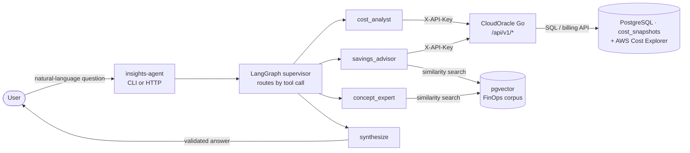

# v3 — Insights Agent

CloudOracle v3 adds an agentic FinOps layer: a polyglot **Go + Python** system
that answers natural-language cost questions ("how much did I spend on AWS in
April?", "where can I save money?", "what is rightsizing?") by orchestrating
LLM specialists over the authenticated `/api/v1` cost API.



The Python agent lives in [`insights-agent/`](../insights-agent/README.md),
which is the source of truth for setup, env vars, and the CLI/HTTP surface.
This guide is the architectural overview and the Go-side contract.

## The two halves

| Half | Where | Responsibility |
| ---- | ----- | -------------- |
| **Go server** | `internal/api`, `internal/billing` | Owns the data: authenticated `/api/v1` cost endpoints, the analyzer recommendations, and the billing source (snapshots or AWS Cost Explorer). A clean data API — no LLM. |
| **Python agent** | `insights-agent/` | Owns the reasoning: LangGraph supervisor, the tools that call `/api/v1`, RAG over a FinOps corpus, guardrails, and the CLI + HTTP surface. |

Keeping RAG and orchestration in Python (where LangChain lives) lets the Go
server stay a small, well-tested data API.

## The `/api/v1` contract

All v1 endpoints sit behind `X-API-Key` (set `CLOUDORACLE_API_KEY` on the
server; the agent sends it). Every response carries a `data_source` field so
the agent surfaces the right caveat.

| Endpoint | Answers | `data_source` |
| -------- | ------- | ------------- |
| `GET /api/v1/cost-summary` | totals per provider | `snapshots_approximation` or `billing_aws_cost_explorer` |
| `GET /api/v1/cost-by-service` | per-service breakdown for one provider | same as above |
| `GET /api/v1/cost-trends` | per-day series + precomputed change/direction | `snapshots_approximation` |
| `GET /api/v1/inventory` | resource counts + cost by provider/service | `live_inventory` |
| `GET /api/v1/recommendations` | rule-based savings opportunities | `heuristic_rules` |

### What each `data_source` means

- **`snapshots_approximation`** — derived from periodic `cost_snapshots`
  (projected monthly rate × days/30), **not** billed spend. Won't match an
  invoice to the cent.
- **`billing_aws_cost_explorer`** — real AWS unblended cost from the Cost
  Explorer API. The approximation caveat does **not** apply. Service names use
  AWS's billing taxonomy (e.g. "amazon elastic compute cloud - compute").
- **`live_inventory`** — counts and per-resource projected cost from the latest
  scan, not billed spend.
- **`heuristic_rules`** — rule-based savings estimates; `monthly_savings_usd` is
  an upper bound to validate before acting.

## Real billing (AWS Cost Explorer)

By default the cost endpoints serve the snapshot approximation. To serve real
AWS billed cost, set on the **server**:

```bash
CLOUDORACLE_BILLING_PROVIDER=aws_cost_explorer   # default: snapshots
# uses AWS_REGION / AWS_PROFILE for credentials
```

The server builds an AWS Cost Explorer source at startup; if that fails (bad
credentials, no `ce:GetCostAndUsage` permission) it logs a warning and falls
back to snapshots so the API keeps serving. The IAM principal needs
`ce:GetCostAndUsage`. Implementation: `internal/billing` (the `Source`
interface + `CostExplorerSource`); GCP and Azure sources can plug into the same
interface later.

## The agent (Python)

Built on a hand-rolled LangGraph `StateGraph` (not `create_react_agent`):

- **Supervisor** routes each turn to one specialist by calling a routing tool,
  or `finish`. A hop cap bounds the loop.
- **Specialists** (each a hand-rolled ReAct loop over a tool subset):
  - `cost_analyst` — cost-summary / cost-by-service / cost-trends / inventory
  - `savings_advisor` — recommendations + knowledge search
  - `concept_expert` — knowledge search (RAG)
- **Synthesizer** composes the final answer in the user's language with the
  data-source caveats and source citations.

### Tools

Five HTTP tools (one per v1 endpoint) plus `finops_knowledge_search`, a RAG tool
over a curated FinOps corpus embedded in **pgvector** (enabled when
`DATABASE_URL` points at the pgvector-backed Postgres; the bundled compose stack
uses `pgvector/pgvector:pg16`). Ingest the corpus with `uv run
insights-agent-ingest`.

### Guardrails

Every run goes through `guardrails/run_guarded`:

- **Cost/usage caps** — bound tool calls, supervisor hops, and per-worker
  iterations (`MAX_TOOL_CALLS`, `MAX_HOPS`, `MAX_WORKER_ITERS`).
- **Layered validation** — deterministic grounding (every monetary figure in
  the answer must match a number in the tool observations; an unmatched figure
  is a hard fail), then an optional LLM judge for numeric answers that pass.
- **Deterministic fallback** — on a run failure or rejected answer, return an
  honest no-LLM response with the raw tool data instead of a fabricated
  narrative.

## Running it

```bash
cd insights-agent
uv sync --extra dev

# CLI
uv run insights-agent --verbose "How much did I spend on AWS in April 2026?"

# HTTP service
uv run insights-agent-serve          # POST /ask {query}, GET /health
```

See [`insights-agent/README.md`](../insights-agent/README.md) for the full env
var table, the RAG ingestion step, the HTTP API, and the offline test strategy,
and [configuration.md](configuration.md) for the Go server's
`CLOUDORACLE_BILLING_PROVIDER` and related vars.
